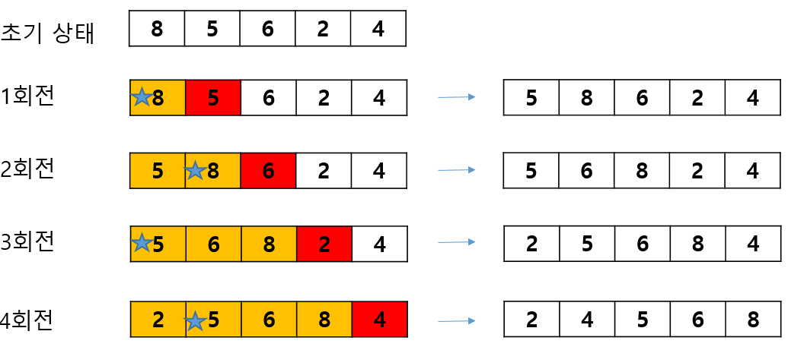
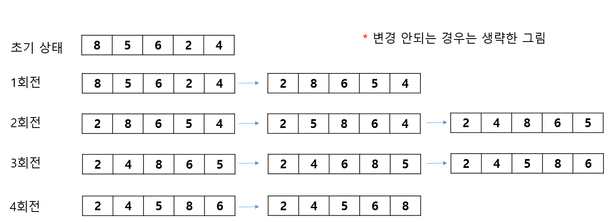
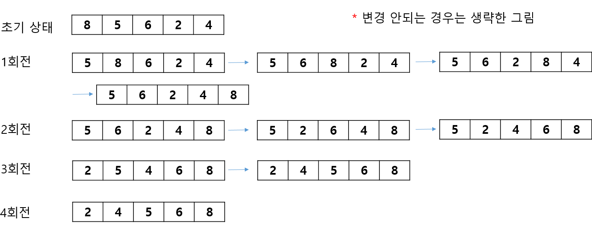
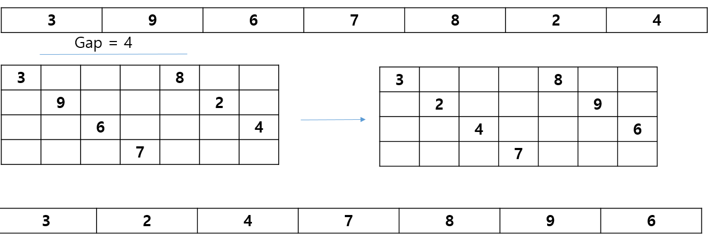
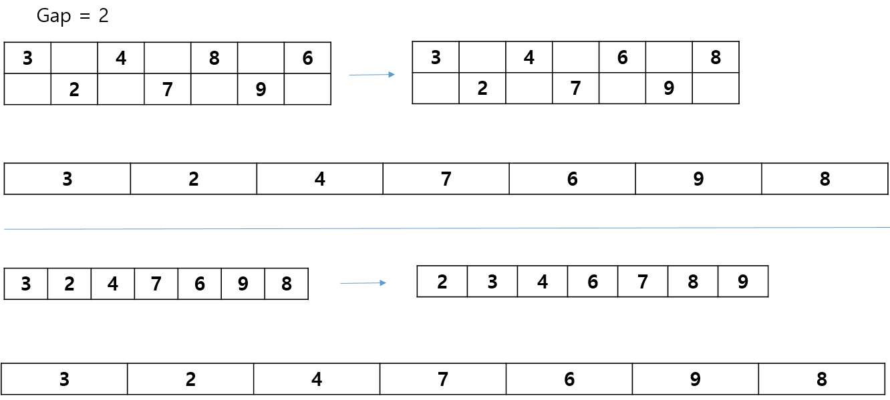
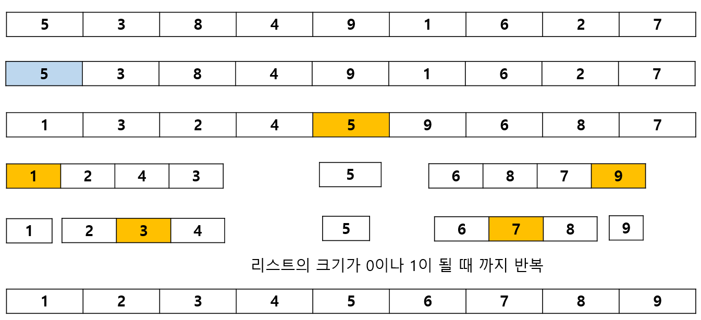
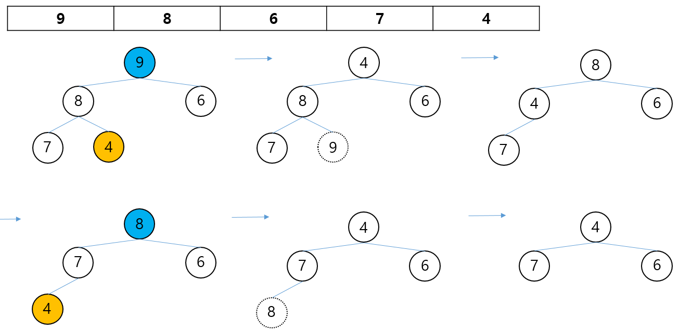
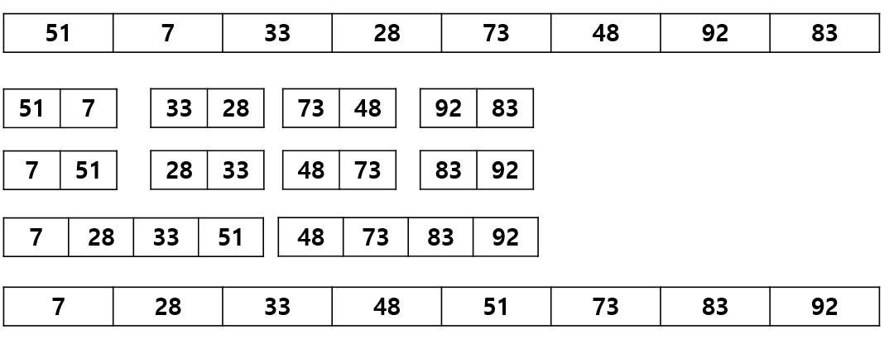
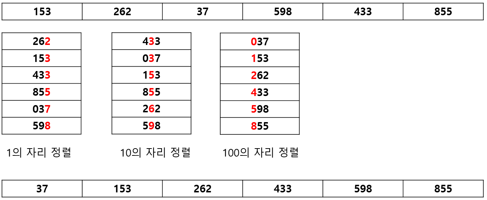

## 1. 삽입 정렬(Insertion Sort)
- 자료 배열의 모든 요소를 앞에서 부터 차례대로 이미 정렬된 부분과 비교하여, 자신의 위치를 찾아 삽입하는 방식 
- 시간 복잡도는 평균과 최악 모두 O(n2)
{: width="100%" height="100%"}
          
## 2. 선택 정렬(Selection Sort)
- N개의 레코드 중에서 최소 값을 찾아 첫 번재 레코드 위치에 놓고 나머지 중에서 다시 최소 값을 찾아 두번째 위치에 놓는 방식을 반복하여 정렬하는 방식
- 시간 복잡도는 평균과 최악 모두 O(n2)
{: width="100%" height="100%"}
   
## 3. 버블 정렬(Bubble Sort)
- 인접한 두 개의 레코드 키 값을 비교하여 그 크기에 따라 레코드 위치를 서로 교환하는 방식
- 시간 복잡도는 평균과 최악 모두 O(n2)
{: width="100%" height="100%"}
   
### 4. 쉘 정렬(Shell Sort)
- 특정 매게 변수(Gap)의 값으로 서브파일을 구성하고, 각 서브 파일을 삽입 정렬 방식으로 정렬하는 과정을 반복하는 정렬 방식   
- 삽입 정렬을 확장한 개념   
- 평균 수행 시간 복잡도는 O(n1.5)이고 최악의 수행 시간 복잡도는 O(n2)

1. Gap=4
{: width="100%" height="100%"}   
2. Gap=2
{: width="100%" height="100%"}
   
### 5. 퀵 정렬(Quick Sort)
- 키를 기준으로 작은 값을 왼쪽, 큰 값은 오른쪽 서브 파일에 분해 시키는 과정을 반복하는 정렬 방식   
- 레코드의 많은 자료 이동을 없애고 하나의 파일을 부분적으로 나누어 가면서 정렬 한다.   
- 평균 수행 시간 복잡도는 O(nlog2n)이고 최악 수행 시간 복잡도는 O(n2)이다.
{: width="100%" height="100%"}

### 6. 힙 정렬(Heap Sort)
- 힙 정렬은 전이진 트리를 이용한 정렬 방식   
- 구성된 전이진 트리를 힙트리로 변환하여 정렬   
- 평균과 최악 모두 시간 복잡도는 O(nlog2n이다.)   
- 힙을 이용하여 배열을 정렬하는 알고리즘   
- 정렬 되지 않은 배열을 최대 힙이나 최소 힙으로 구성하고 루트 노드를 가장 마지막 노드와 교환 후 힙 크기를 줄이는 방식
{: width="100%" height="100%"}

### 7. 2-Way 합병 정렬(Merge Sort)
이미 정렬되어 있는 두 개의 파일을 한 개의 파일로 합병하는 정렬 방식
평균과 최악 모두 시간 복잡도는 O(nlog2n)이다.
{: width="100%" height="100%"}

### 기수 정렬(Radix Sort, Bucket Sort)
- Queue를 이용하여 자리수 (Digit) 별로 정렬하는 방식이다.
- 레코드의 키 값을 분석하여 같은 수를 또는 같은 문자끼리 그 순서에 맞는 버킷에 분배하였다가 버킷의 순서대로 꺼내어 정렬한다.
- 평균과 최악 시간 모두 시간 복잡도는 O(dn)이다. (자리수 비례)
{: width="100%" height="100%"}