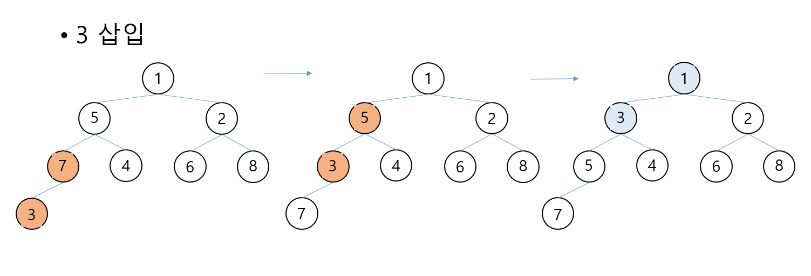
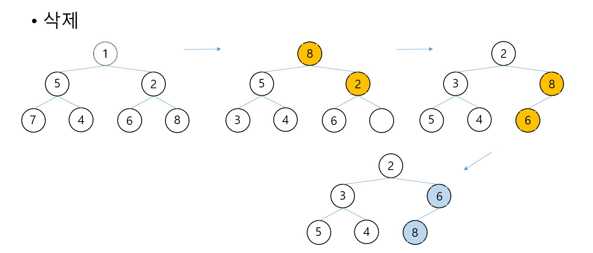

## Heap(힙)
완전 이진 트리의 일종으로 우선순위 큐를 위하여 만들어진 자료구조이다.

## 특징
- 최대값과 최소값을 빠르게 찾아내도록 만들어진 자료 구조
- 보통 배열을 통해 구현한다.
- 최대 힙(Max-Heap)과 최소 힙(Min-Heap)이 있다.
  - 부모가 자식 보다 큰 값인지 작은 값인지로 구분

## 삽입, 삭제
### 삽입
1. 우선 완전 이진 트리의 마지막 노드에 이어서 새로운 노드를 추가한다.
2. 추가된 새로운 노드를 부모의 노드와 비교하여 교환한다.
3. 정상적인 힙 트리가 될 때까지 반복한다.

### 삭제
1. 루트 노드를 제거한다.
2. 루트 노드가 삭제된 빈 자리에 완전 이진 트리의 마지막 노드를 가져온다.
3. 루트 자리에 위치한 새로운 노드를 자식 노드와 비교하여 교환한다.
4. 정상적인 힙 트리가 될 때까지 반복한다.

우선 순위 Que를 위한 자료 구조이기에 삭제는 루트 노드의 제거이다.

{: width="100%" height="100%"}
   
   
{: width="100%" height="100%"}

## 참조
https://gmlwjd9405.github.io/2018/05/10/data-structure-heap.html