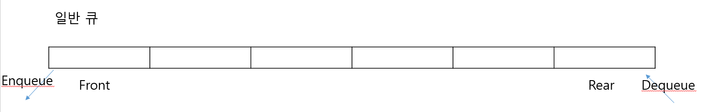
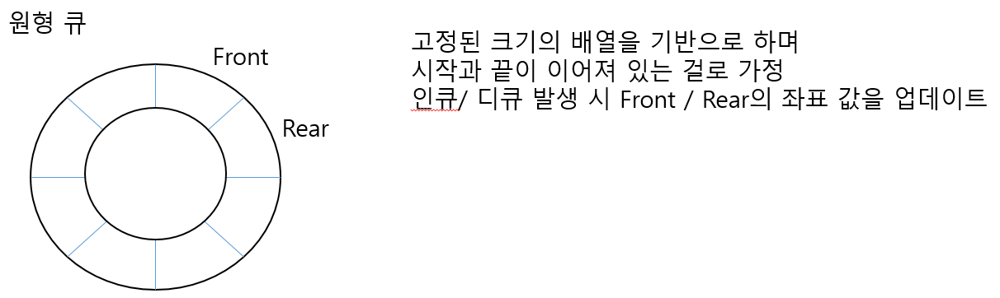

## Que 
리스트의 한쪽에서는 삽입 다른 한쪽에서는 삭제 작업이 이루어지는 형태의 선형 자료 구조

## Que 특징
 
- 선입선출,First In First Out(FIFO)
- 시작을 표시하는 프런트(Front) 포인터와 끝을 표시하는 리어(Rear) 포인터가 있다.
- 인큐(Enqueue)가 삽입, 디큐(dequeue)가 추출 작업이다.
- 배열을 통해 구현할 수 있으나 디큐 시 데이터를 꺼내고 데이터들의 위치를 이동하는 처리가 필요하여 이를 보안하기 위해 링버퍼를 이용한 원형 큐가 있다.

## 그래픽

   
   
