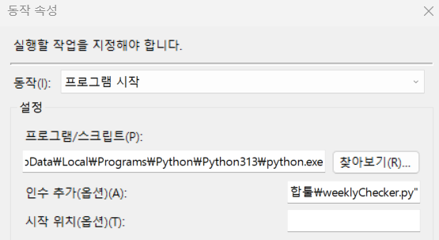

## 문제 
윈도우 작업 스케줄러에 파이썬 파일을 등록 했는데 실행 되지 않았다.

## 해결
동작 속성에서 
프로그램/스크립트에 python 경로를 입력하고 
인수 추가(옵션)(A)에 실행 하려는 파일 경로를 ""로 감싸 넣었다.

## 참고 
- [python-파이썬-파일-주기적-실행-작업-스케줄러](https://yeko90.tistory.com/entry/python-%ED%8C%8C%EC%9D%B4%EC%8D%AC-%ED%8C%8C%EC%9D%BC-%EC%A3%BC%EA%B8%B0%EC%A0%81-%EC%8B%A4%ED%96%89-%EC%9E%91%EC%97%85-%EC%8A%A4%EC%BC%80%EC%A4%84%EB%9F%AC)
- [윈도우10-명령-프롬프트-커맨드-창-cmdexe-에서-공백문자-표현시-따옴표-감싸기](https://igotit.tistory.com/entry/%EC%9C%88%EB%8F%84%EC%9A%B010-%EB%AA%85%EB%A0%B9-%ED%94%84%EB%A1%AC%ED%94%84%ED%8A%B8-%EC%BB%A4%EB%A7%A8%EB%93%9C-%EC%B0%BD-cmdexe-%EC%97%90%EC%84%9C-%EA%B3%B5%EB%B0%B1%EB%AC%B8%EC%9E%90-%ED%91%9C%ED%98%84%EC%8B%9C-%EB%94%B0%EC%98%B4%ED%91%9C-%EA%B0%90%EC%8B%B8%EA%B8%B0)